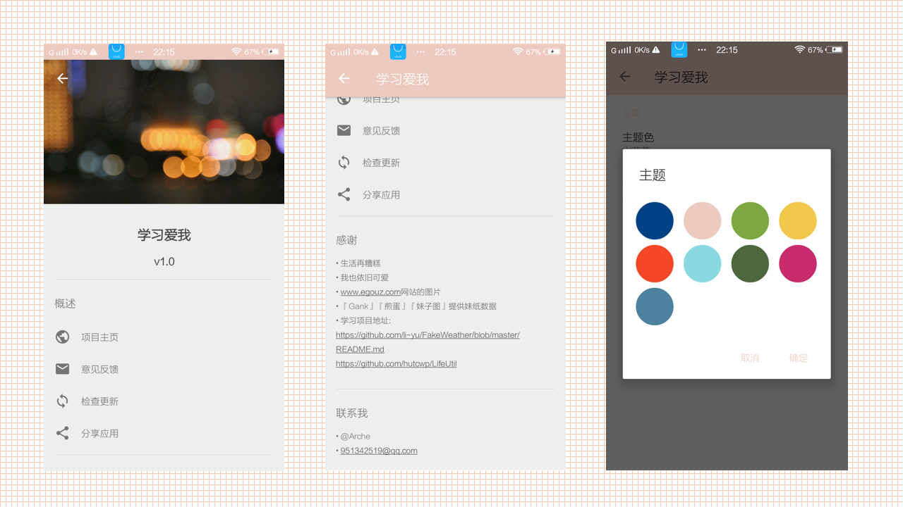
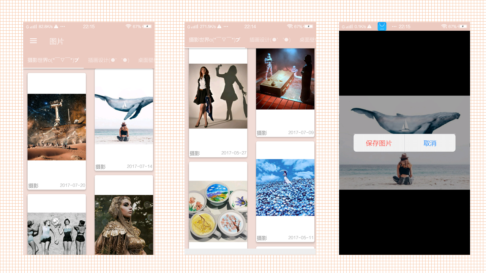
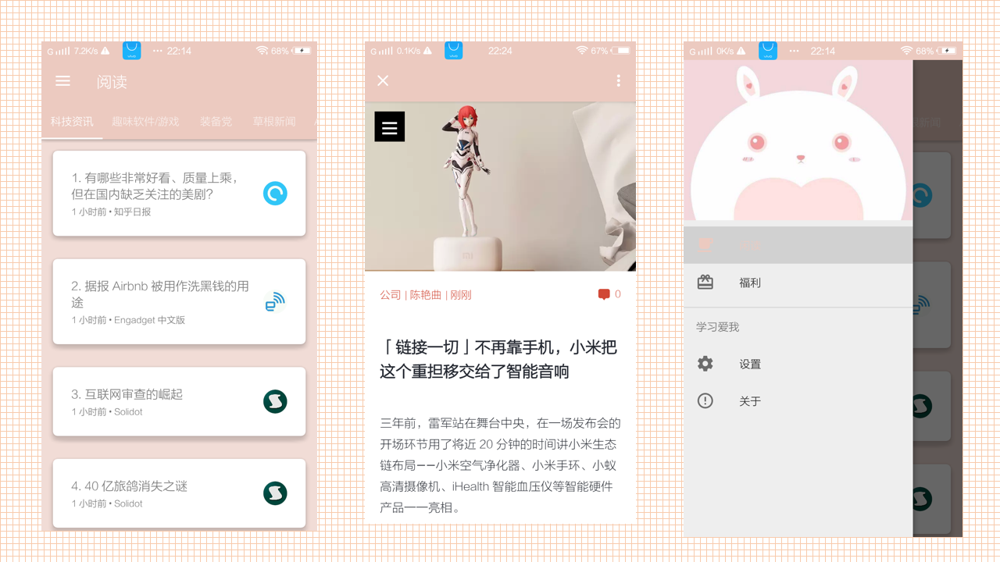

# 学习爱我
一款Material Design风格，阅览资讯和图片的Android软件 这个项目的是仿造开源项目『假装看天气』而开发的。

# 使用的技术
> DataBinding

> RxJava

> Retrofit

> EventBus

## 功能
> 1、阅读文章。

> 2、查看图片。

> 3、保存图片。

> 4、更改主题。

> 5、清除缓存。

## 界面

